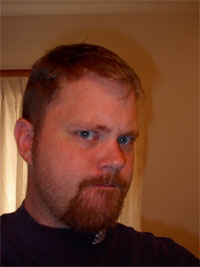

<html xmlns="http://www.w3.org/1999/xhtml" xml:lang="en" lang="en">
<head>
	<meta http-equiv="Content-Type" content="text/html; charset=utf-8"/>

	<title>[MVRWC]</title>
	
	
	
	
	
	
	
	
	<link rel="stylesheet" href="css/960-reset.css" type="text/css" media="screen" charset="utf-8" />
<link rel="stylesheet" href="css/text.css" type="text/css" media="screen" charset="utf-8" />
<link rel="shortcut icon" href="favicon.ico" />
	
	
	
	
	
	
	
</head>

<body>

	

	

	

		<h1>[MVRWC]</h1> 
		
John Stansbury <del>is</del> <strong>was</strong> a former Internet mogul set on linking to every page on the internet — the interesting ones, at least.
 
				
<small style="text-align:center;">Yes, I am that mean</small>
 
				
This is the guy who made forums fun and popular. He’s actually very sorry about that. Had to do something while the internet stocks were crashing back in the 90s. At least he had nothing to do with Digg, so maybe that evens things out?
 
				<h2>MVRWC.com: The Home of fun™</h2> 
				
Or, where we used to keep the fun, before we stopped making it. And by ‘we’ I mean ‘me’ — <em>ya ingrates</em>. So now it’s just a bunch of ‘where stuff used to be’.
 
				
John currently isn’t writing or blogging or social networking as MVRWC anywhere. That’s because he has better things to do with his time. Like — say — picking lint out of his belly button. He does post the occasional picture or funny link (but not that often, mind you).
 
				
Perhaps you were looking for something else? Because the something else is gone now. Sorry about all that.
 
				
Time was when I worked hard to make all this internetty stuff. No more. Make your own internet, I’m done here.
 
	
<!-- end .grid_12 -->
	
&nbsp;

<!-- MEATSPACE -->

		

		<h3>Less lazy talk, more MVRWC!</h3> 
		
The website and the person are connected parts of the whole. But the website looks better. So far, this is just the journal of how to make a website look like a website. That&#8217;s mighty fine with me.
 
		
Think of this as a journey, a trial by fire, a coming-of-age flick. Or the other kind of flick, I don&#8217;t care. Mmm&#8230;flick&#8230;<em>focus, John, focus</em>&#8230;
 
		
Just think of it. Or not. I&#8217;m all about value, and not giving you anything you didn&#8217;t already want. Or something&#8230;did any of you understand that? Can you explain it to me? Seriously, it made no sense. Actually, that&#8217;s about the best thing I could write on my About page.
 
		<h3>Accomplishments</h3> 
		
Someday I&#8217;m going to stop doing stuff, and get around to putting in all my accomplishments over the years. That should take up another paragraph. Or two. I should stop now.
 
		
Accomplishments, accomplishments&#8230;I did finish junior high in less than 8 years, that&#8217;s something. And I&#8217;ve never drowned any kittens that I know of. And I&#8217;ve only once set fire to a school full of children. All that&#8217;s accomplishments-y, right?
 
		
Okay, <em>now</em> I should stop. I blame my liberal upbringing. Yeah, that&#8217;s it.
 
		<h3>You seem to talk about links a lot</h3> 
		
In the 6th iteration of this site, I found it necessary to put in a link list. That&#8217;s because I&#8217;ve been dropping links to people since 1996, but never in a focused way. Using Miniblog, I started to get the hang of linking. When I moved to del.icio.us, it all became automatic. My move to Ma.gnolia was purely because I could be a big fish in a small pond, if you will.
 
		
Upon building the WordPress version of this site, the first page I put up was the links page, With a linkness. After getting a touch dissatisfied with Miniblog, I started using a category for links. Then came del.icio.us, and I became a linking superstar. Ma.gnolia soon followed, and my lust for power was only satiated with the change to my old Movable Type link blog.
 
		
Problem was, as always, not many people were paying attention to the linking. Not that I&#8217;m disappointed by that; it&#8217;s to be expected. I am a champion linker, you know, and I&#8217;ll continue to do that, just without the expectations of grandeur. 
 
		
Unless, of course, somebody wants to borrow me some grandeur.
 
		
Anybody?
 
		
&nbsp;

		


 
<a href="{{ post.url }}">{{ post.title }}</a> - {{ post.date | date: "%B %d, %Y" }}



	
<!-- end .grid_6 -->

<!-- /MEATSPACE -->

<h4>Daily Trivia</h4>

	
	
	

<small>&copy; <?php echo date("Y"); ?> John Stansbury. All rights reserved.</small>

<!-- end grid_12 -->
	
	
	
	
	
	
	
	
	
	
<!-- /FOOTER -->

&nbsp;

<!-- end container_12 -->

</body>
